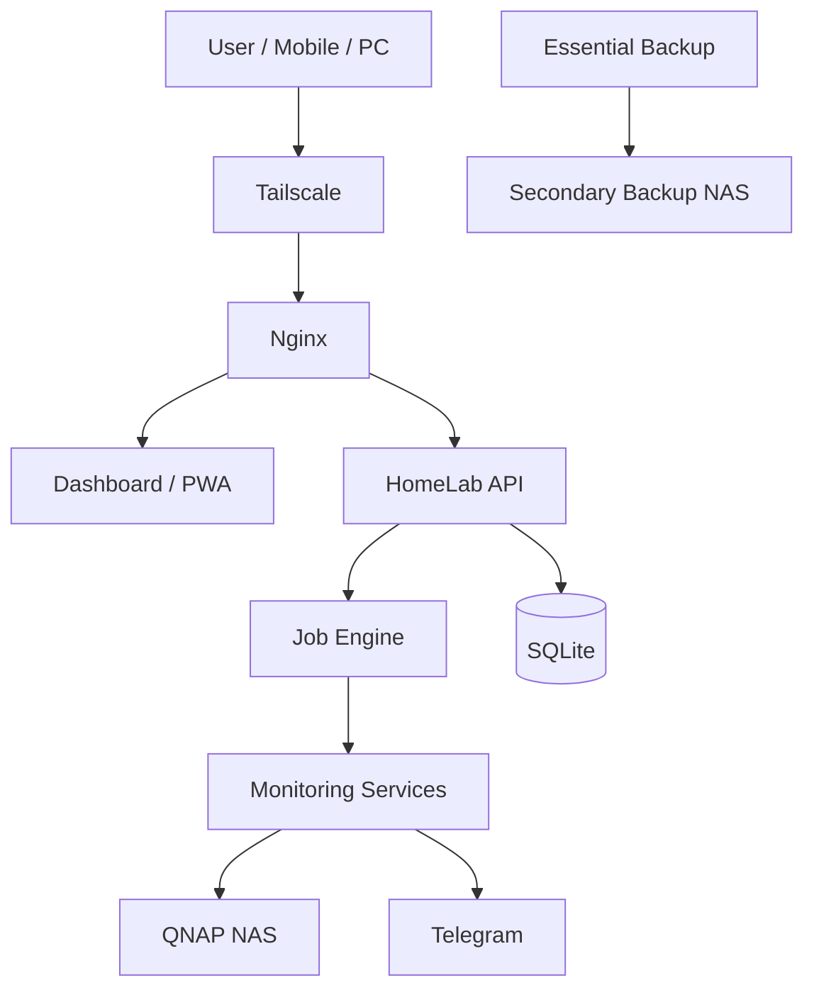

# 🏠 HomeLab Monitor

Self-hosted monitoring and recovery platform for a personal home lab.
It watches infrastructure, serves a web dashboard, sends Telegram
notifications and reports, watches photo folders, reads QNAP status,
and keeps validated backup sets for recovery.

The production host is an Ubuntu Server (`home-srv-01`) running Docker,
Nginx, Tailscale, and systemd.

## Overview

Agents on the Ubuntu host send authenticated health reports to a FastAPI
service. The API stores history in SQLite, runs a small job engine, and
serves a React PWA. Nginx sits in front of the dashboard and API.
Remote access is through Tailscale.

## Key features

**Monitoring.** Offline checks, infrastructure snapshots, and alert
evaluation. One failed connector does not fail the others.

**Dashboard.** React PWA with REST and a dashboard WebSocket. Role-based
login (admin, operator, viewer).

**Notifications.** Telegram alerts, plus hourly, daily, and weekly
reports. Photo events can notify Telegram. Tokens and chat IDs stay in
environment files, not in git.

**NAS integration.** Read-only QNAP system information, disk temperature,
thresholds, and alerts. Photo pages observe Immich, QuMagie, and
configured folders. They do not upload, index, or delete files.

**Backup and disaster recovery.** The API keeps its own SQLite gzip
backups. Separately, Essential Backup v1 on the host writes hourly
recovery sets to a secondary NAS, with retention, manifests, and SHA256
checks.

**Recovery and resilience.** Boot helpers wait for NAS storage before
treating Immich as ready, and wait for the Tailscale address before
Nginx binds. Both paths were checked with a real reboot.

**Remote access.** Tailscale, then Nginx, then the dashboard and API.
The application does not configure Tailscale.

## Architecture



Agents only make outbound connections. They do not open inbound ports.
More detail: [architecture](docs/architecture.md).

## Job engine

Six jobs:

- `offline_monitor`
- `infrastructure_monitor`
- `telegram_reports`
- `notification_worker`
- `photo_watcher`
- `sqlite_backup`

`JobExecutionWrapper` owns lifecycle and execution. Scheduler ownership
moved job by job:

| Phase | What changed | State |
| --- | --- | --- |
| 13.11 | QNAP recovery / integration | Complete |
| 13.12 | Job execution wrapper | Complete |
| 13.13 | Backup clock | Complete |
| 13.14 | Report clock | Complete |
| 13.15 | Photo watcher interval | Complete |
| 13.16 | Shared repetition ownership | Complete |

Decisions are recorded under [docs/rfc](docs/rfc/) (RFC-0001 through
RFC-0007).

## Telegram

Notifications cover infrastructure alerts, photo events, and scheduled
reports (hourly, then daily, then weekly, Asia/Bangkok). Delivery is
queued and retried. Set `TELEGRAM_BOT_TOKEN`, `TELEGRAM_CHAT_ID`, and
`HOMELAB_TELEGRAM_ENABLED` outside git. Guide:
[telegram](docs/telegram.md).

## QNAP

Infrastructure connectors issue GET-only snapshots. Temperature
thresholds can raise alerts. The monitor does not invent SMART,
manufacturer, or capacity values the NAS did not return.
[infrastructure](docs/infrastructure.md).

## Backup and disaster recovery

Essential Backup v1 runs on the host, not inside the HomeLab job list.

```text
home-srv-01
    │  hourly, after a successful local stage
    ▼
secondary NAS
    ├── hourly recovery sets (keep 24)
    ├── daily recovery sets (keep 7)
    └── manifest and SHA256 checksums
```

A set can include a safe SQLite backup of HomeLab, an Immich
`pg_dump`, an Open WebUI SQLite backup, application config, project
source (without dependency trees), Nginx/systemd/PM2 recovery files,
and media-service configuration. A short local retention keeps a couple
of completed sets on the server. NAS credentials are not stored in the
repository.

The in-app SQLite backup (daily, gzip, integrity check) is separate.
See [backup](docs/backup.md).

## Restore proof

A backup counts only after a restore check, not because the files exist.

An isolated test restored one recovery set without changing production:

- HomeLab SQLite restored, integrity check passed, application tables readable
- Open WebUI SQLite files restored, integrity checks passed
- Immich dump restored into a temporary PostgreSQL container, schema and table checks passed, then the container was removed

## Boot recovery

**Immich.** Docker could start the server before the NAS share was
mounted. A helper checks that the share is the expected mount, a
systemd timer retries, and a container that is already running is left
alone. A real reboot recovered Immich without a manual start.

**Nginx.** Nginx could bind before the Tailscale address existed. A
readiness helper runs before `nginx -t` and start. A recovery timer
starts Nginx only if it is not already active. A real reboot showed the
helper succeed, then Nginx, with no bind error.

## Operations

Storage maintenance is host work, not an application feature.

The root filesystem reached about 87% full. Most of that growth was
Docker/BuildKit cache in containerd. A controlled prune removed build
cache only. Root use fell to about 75%, and the filesystem gained about
11.3 GiB. Production images, containers, volumes, and HomeLab and Immich
rollback images were left in place. Docker data was not moved to a hard
disk.

## Security

Secrets stay in untracked env files. Remote access is limited to the
tailnet. Backup promotion checks checksums. Restore drills use a
temporary database, not the live one. Cleanup that deletes data is run
on purpose, not by the app.

This is not a claim that the system is perfectly secure.

Governance for scheduler ownership lives in [docs/rfc](docs/rfc/).

## Project status

| Work | State |
| --- | --- |
| Phases 13.11–13.15 | Complete |
| Phase 13.16 | Complete |
| Backup / DR discovery | Complete |
| Essential Backup v1 | Complete |
| Isolated restore test | Passed |
| Immich boot recovery | Passed a real reboot |
| Nginx / Tailscale boot recovery | Passed a real reboot |
| Storage cleanup (build cache only) | Complete |

## Roadmap

Phase 13.16 is complete. Scheduler phases 3–6 are complete. `run_repeated` repeats the five periodic jobs. Each helper still owns its own wait. The notification worker still drains its queue.

A later Phase 14 idea is advisory AI: read HomeLab data, explain and
diagnose, suggest an action plan, and wait for approval before any
allowlisted action. That analyzer is not implemented. The first version,
if built, stays read-only until an action is explicitly approved.

## Quick start

Requirements: Python 3.12+, `python3-venv`, Node.js 22+ for the dashboard.

```bash
python3 -m venv .venv
.venv/bin/pip install -e ".[dev]"
cp .env.example .env
# Set HOMELAB_REGISTRATION_KEY, HOMELAB_JWT_SECRET, and
# HOMELAB_BOOTSTRAP_ADMIN_PASSWORD
.venv/bin/alembic upgrade head
.venv/bin/uvicorn homelab_monitor.main:app --reload
```

API: `http://127.0.0.1:8000` — OpenAPI `/docs`, health `/health`.

```bash
cd dashboard
npm install
npm run dev
```

Log in at `/login` with the bootstrap admin user.
[authentication](docs/authentication.md), [RBAC](docs/rbac.md),
[user management](docs/user-management.md).

Release notes for the 1.0.0 release candidate:
[v1.0.0-rc3](docs/release-notes-v1.0.0-rc3.md),
[project status](PROJECT_STATUS.md), [changelog](CHANGELOG.md),
[known limitations](docs/known-limitations.md).

## Docker

```bash
cp .env.production.example .env
# Replace secrets and HOMELAB_BOOTSTRAP_ADMIN_PASSWORD
docker compose up -d --build
curl -fsS http://127.0.0.1:8080/health
```

Only the dashboard port is published (`127.0.0.1:8080` by default).
Nginx proxies `/api`, `/ws`, and `/health`.
[docker](docs/docker.md), [deployment](docs/deployment.md),
[nginx](docs/nginx.md), [remote access](docs/remote-access.md),
[PWA](docs/pwa.md).

## Environment variables

Copy [`.env.example`](.env.example) or
[`.env.production.example`](.env.production.example). Never commit a
filled-in `.env`.

| Variable | Role |
| --- | --- |
| `HOMELAB_ENVIRONMENT` | `development` or `production` |
| `HOMELAB_REGISTRATION_KEY` | Agent registration |
| `HOMELAB_JWT_SECRET` | Dashboard JWT |
| `HOMELAB_BOOTSTRAP_ADMIN_PASSWORD` | Creates or rotates `admin` in production |
| `HOMELAB_BOOTSTRAP_OPERATOR_PASSWORD` | Optional `operator` user |
| `HOMELAB_BOOTSTRAP_VIEWER_PASSWORD` | Optional `viewer` user |
| `TELEGRAM_BOT_TOKEN` / `TELEGRAM_CHAT_ID` | Telegram Bot API |
| `HOMELAB_TELEGRAM_ENABLED` | Delivery on or off |
| `HOMELAB_NOTIFICATION_WORKER_ENABLED` | Background Telegram worker |
| `HOMELAB_INFRASTRUCTURE_MOCK` | Synthetic NAS and photo snapshots when true |
| `HOMELAB_BACKUP_ENABLED` / `HOMELAB_BACKUP_PATH` | In-app SQLite gzip backups |

## Photo pages

**Photo Services** observes Immich, QuMagie, and QNAP photo storage.
Mock mode is the default until live URLs are configured.
[photo-services](docs/photo-services.md).

**Photo Monitor** (`/photo-monitor`) records new image files in a
configured folder and can notify Telegram. It does not analyze images.
[photo-monitor](docs/photo-monitor.md).

## Ubuntu agent

```bash
.venv/bin/homelab-agent collect
.venv/bin/homelab-agent --env-file ./agent.env run
```

Register via [docs/api.md](docs/api.md). Failed reports stay in a local
SQLite queue. [agent](docs/agent.md), [alert rules](docs/alert-rules.md),
[history](docs/history.md).

## Troubleshooting

| Symptom | What to check |
| --- | --- |
| API exits immediately in Docker | Production requires `HOMELAB_BOOTSTRAP_ADMIN_PASSWORD` |
| Cannot log in | Bootstrap env on first start; JWT secret unchanged after tokens were issued |
| No Telegram messages | Token, chat ID, Telegram enabled, worker enabled |
| Photo or QNAP data looks fake | `HOMELAB_INFRASTRUCTURE_MOCK=true` |
| Dashboard empty after refresh | Nginx `/api` proxy and `VITE_API_BASE_URL=/api/v1` in the image |
| Health 503 | SQLite volume permissions and migrations |

```bash
.venv/bin/pytest
.venv/bin/ruff check .
cd dashboard && npm run lint && npm run test && npm run build
```

## License

[MIT](LICENSE)
