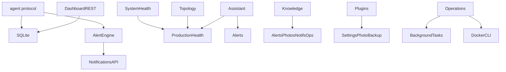

# API catalog

All routes below are under `/api/v1` unless noted. Auth: **JWT** (`admin`/`operator`/`viewer`) or **agent bearer**. Additive Phase 12 routes are marked *P12*.

## Health (no JWT)

| Method | Path | Notes |
| --- | --- | --- |
| GET | `/health` | Process + SQLite ping (`agents`, `alerts` counts) |

## Auth

| Method | Path | Roles |
| --- | --- | --- |
| POST | `/api/v1/auth/login` | public |
| GET | `/api/v1/auth/me` | any authenticated dashboard user |

## Agent protocol (frozen)

| Method | Path | Auth |
| --- | --- | --- |
| POST | `/api/v1/agents/register` | registration key |
| POST | `/api/v1/agent/check-ins` | agent bearer |
| POST | `/api/v1/agent/reports` | agent bearer |

## Dashboard core

| Method | Path | Roles |
| --- | --- | --- |
| GET | `/dashboard/overview` | a/o/v |
| GET | `/agents` | a/o/v — **frozen summary fields** |
| GET | `/agents/{id}` | a/o/v |
| GET | `/agents/{id}/latest` | a/o/v |
| GET | `/alerts` | a/o/v |
| POST | `/alerts/{id}/acknowledge` | a/o |
| GET | `/agents/{id}/history` | a/o/v |
| GET | `/ws/dashboard` | JWT query token |

## Groups, users, rules

CRUD under `/groups`, `/users`, `/alert-rules` with writer roles on mutating verbs.

## Notifications (two UI surfaces)

| Method | Path |
| --- | --- |
| GET/POST | `/notifications`, `/notifications/test`, `/notifications/test-report` |
| GET | `/notifications/history`, `/statistics`, `/metrics`, `/delivery-history` |
| GET | `/notifications/center` |
| GET/PUT | `/notifications/settings` |

## Infrastructure, photos, backup, analytics family

- `/infrastructure`, `/infrastructure/{service}`, health-style snapshots  
- `/photos/*` events, stats, settings  
- backup status via dashboard backup client (`/backup` family as implemented)  
- `/analytics/*`, `/trends/*`, `/capacity/*`, `/insights/*`, `/predictions/*` — overlapping read models of the same SQLite history  

## Developer / system / operations

| Method | Path | Roles | Tag |
| --- | --- | --- | --- |
| GET | `/developer/overview` | admin | Mission Control |
| GET | `/system/health|runtime|storage|network|remote-access` | a/o/v | Production Health |
| GET | `/system/topology` | a/o/v | *P12* |
| GET/POST | `/operations`, `/operations/history`, `/operations/{id}/run` | operator+; some admin_only | Operations Center |

## Phase 12 platform

| Method | Path | Roles |
| --- | --- | --- |
| GET | `/plugins` | a/o/v |
| POST | `/plugins/{id}/lifecycle` | admin |
| GET | `/assistant/briefing` | a/o/v |
| GET | `/knowledge`, `/knowledge/export` | a/o/v including CSV |

## API dependency graph

## Review findings (no code change)

**Duplicate / overlapping reads**

- Analytics, trends, capacity, insights, predictions all derive from metric history / ops snapshots.
- `/notifications` list vs `/notifications/center` vs `/notifications/history`.
- Infrastructure connectors vs Production Health vs Topology (three views of host/Docker/Telegram).

**Unused / deprecated**

- No formally deprecated routes. Discord/Slack/email settings exist; live alert path is Telegram.
- Frontend `ForbiddenPage` is used; no orphan routers found.

**Large payloads**

- `GET /developer/overview` aggregates git, runtime, statistics.
- `GET /system/health` also **writes** a performance `OpsSnapshot` (side effect on a GET).
- Knowledge and notification center return up to hundreds of rows.
- Agent `MetricReport.payload` is full JSON per report.

**Breaking-change risks**

- Extra fields on `AgentSummary` previously broke exact-key tests — keep six-field contract.
- Plugin lifecycle POST is new; do not overload frozen agent URLs.
- CSV export content is not versioned.

**Authz note:** knowledge export is readable by **viewer**. That is a product risk, not a contract bug. See [security-review.md](security-review.md).
