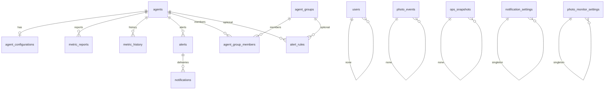

# Database (SQLite) — freeze review

No schema changes in Sprint 12.7.

## Engine

- URL from `HOMELAB_DATABASE_URL` (Compose: `sqlite:////var/lib/homelab-monitor/homelab-monitor.db`)
- WAL journal, `foreign_keys=ON`, `check_same_thread=False`
- Migrations: Alembic `api/migrations/versions/0001`–`0010`, `alembic upgrade head` on API start
- Tests use `Base.metadata.create_all` (parallel to Alembic)

## ER diagram

## Tables

| Table | Role | JSON / blobs |
| --- | --- | --- |
| agents | Registry | `capabilities` JSON |
| agent_configurations | Per-agent settings | `settings` JSON |
| metric_reports | Idempotent ingest | `payload` JSON (full report) |
| metric_history | Flattened series | numeric columns |
| alerts | Open/resolved | scalars |
| alert_rules | Custom thresholds | scalars + FKs |
| agent_groups / members | Fleet grouping | — |
| users | Dashboard RBAC | password_hash |
| notifications | Delivery rows | — |
| notification_settings | Channel config | `payload` JSON |
| photo_events | New files | — |
| photo_monitor_settings | Watcher config | `watch_folders` JSON |
| ops_snapshots | Trends, photos, performance | `payload` JSON |

## Indexes / FKs

Indexed FKs on agent_id, observed_at, alert status, photo folder/telegram_sent, ops kind/observed_at. Unique: agent name/token_hash, report `(agent_id, report_id)`, alert `(agent_id, kind, resource)`, photo `(folder, filename)`.

Notifications `alert_id` is `ON DELETE SET NULL`.

## Off-schema files

| File | Purpose |
| --- | --- |
| `operations-history.json` next to DB | Operations Center history |
| gzip under backup path | SQLite copies + `.sha256` |
| notification in-memory queues | not durable across restart |

## Migration history

0001 initial → 0002 alerts → 0003 users → 0004 metric_history → 0005 groups → 0006 notifications → 0007 alert_rules → 0008 ops_snapshots → 0009 photo_events → 0010 watch_folders.

No Alembic revision for operations JSON or plugin registry (plugins are files + RAM).

## Optimization opportunities (do not implement in freeze)

1. Bound `metric_reports.payload` retention; history table already flattens CPU/mem/disk.
2. Composite index `(kind, observed_at)` on `ops_snapshots` if performance GET volume grows.
3. Knowledge Center currently issues six independent `LIMIT 100` queries then sorts in Python.
4. Naive vs aware `DateTime` rows historically broke window compares (defensively handled in performance `_window`).
5. SQLite single-writer: concurrent backup + photo scan + report ingest will serialize.
