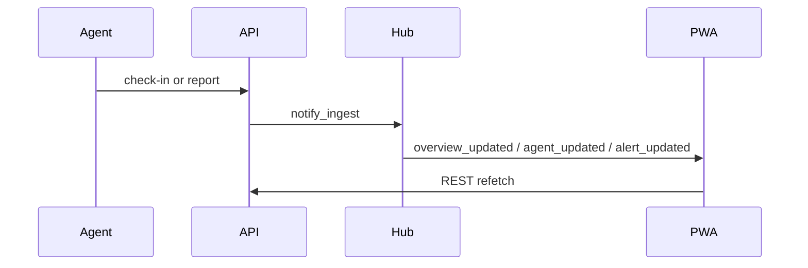
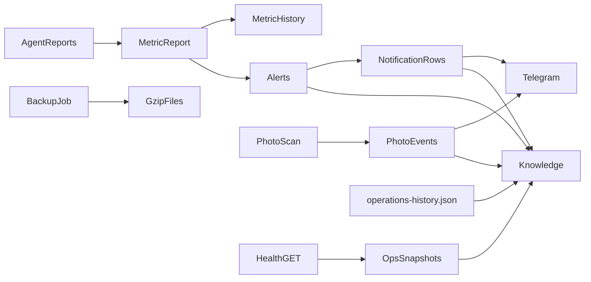
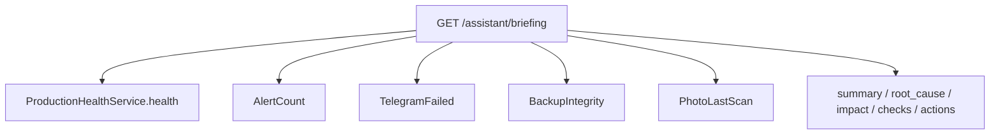

# Event, knowledge, and AI flows

## Event flow (realtime)

Alert engine, photo events, and backups do not all emit the same hub events; the PWA also polls (~30s).

## Platform data flow

## Knowledge flow

`knowledge.collect` concatenates last 100 alerts (kind `incident`), notifications (`telegram`), photo events, ops snapshots (`system`), latest backup state (`backup`), operations JSON (`maintenance`). Query string filters title/details; `kind` filters. Export is CSV `kind,timestamp,title`.

## AI read-only flow

`LocalHeuristicProvider` never writes. `never_modifies_platform` is always true. No external LLM.

**Side effect caveat:** `ProductionHealthService.health` records a performance snapshot. Assistant and topology inherit that GET-write. Root cause: health aggregator reused for reads. Impact: extra `ops_snapshots` rows. Recommended fix: split read snapshot from collect_and_store (do not change in freeze).
