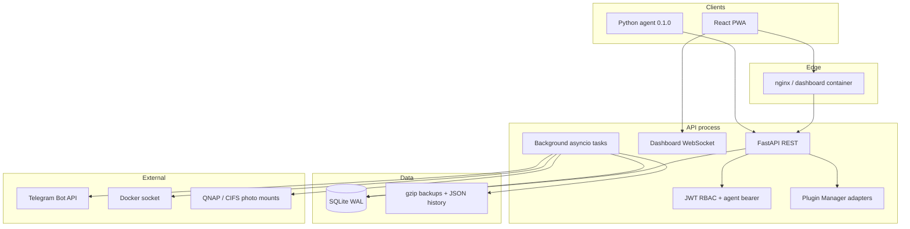
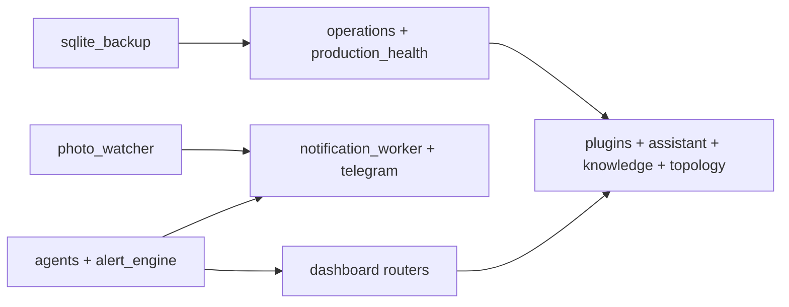
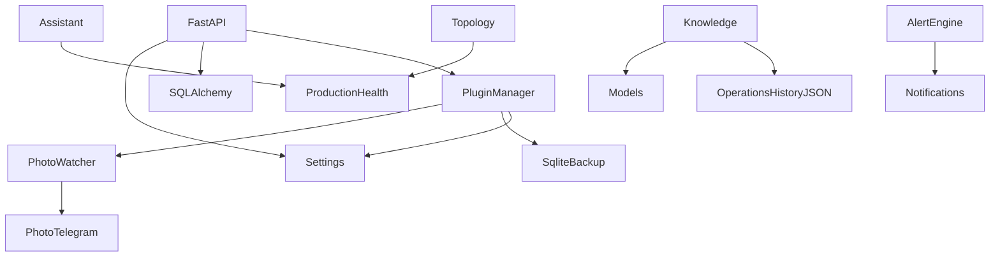
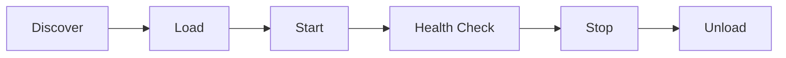
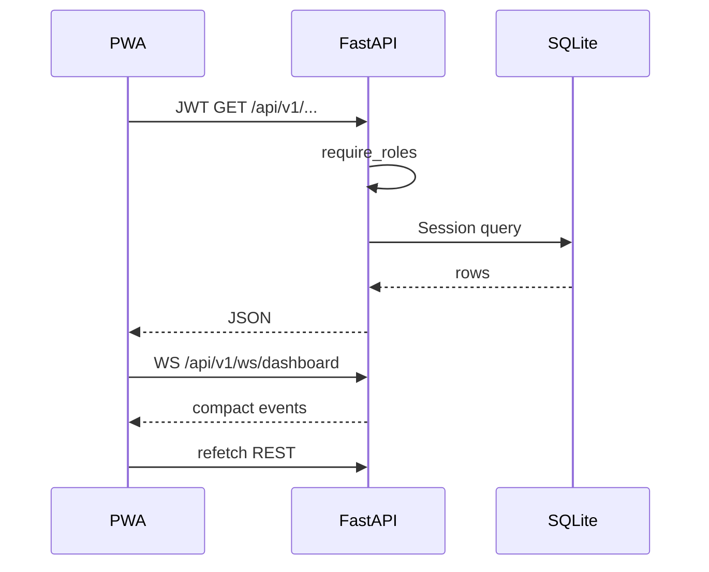
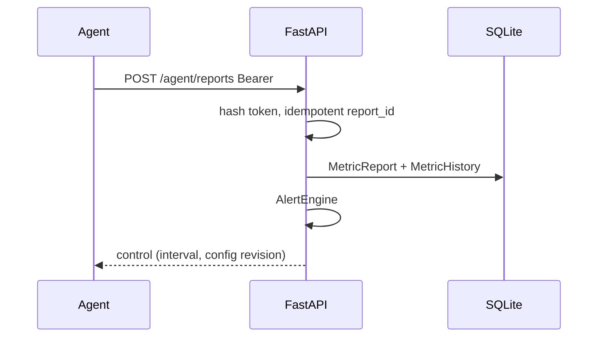

# Platform architecture (freeze)

HomeLab Monitor is a single-host agent-server monitor: Python agents POST metrics; FastAPI persists SQLite, evaluates alerts, notifies Telegram, and serves a React PWA.

## Layer diagram

## Module diagram

## Dependency graph (runtime)

## Service interaction

| Actor | Talks to | How |
| --- | --- | --- |
| Agent | API | HTTPS bearer token, 60s default |
| Dashboard | API | JWT REST + `GET /api/v1/ws/dashboard` |
| API | SQLite | SQLAlchemy sessions |
| Notification worker | Telegram | Bot API |
| Photo watcher | CIFS mounts | filesystem scan |
| Backup scheduler | data volume | gzip copy + integrity |
| Operations Center | Docker CLI | restart named containers (admin) |

## Plugin lifecycle

Adapters record lifecycle in process memory. Stopping a plugin does **not** cancel the corresponding asyncio worker. See [plugin-architecture.md](plugin-architecture.md).

## Request flow (dashboard)

## Request flow (agent)

## Component relationship

Browser PWA → nginx static + `/api` proxy → FastAPI → SQLite.  
Background tasks share the API process: offline monitor, infrastructure monitor, Telegram reports, notification worker, photo watcher, SQLite backup.  
Plugin Manager, AI assistant, topology, and knowledge **read** those same stores.

Existing architecture narrative: [architecture.md](architecture.md).
